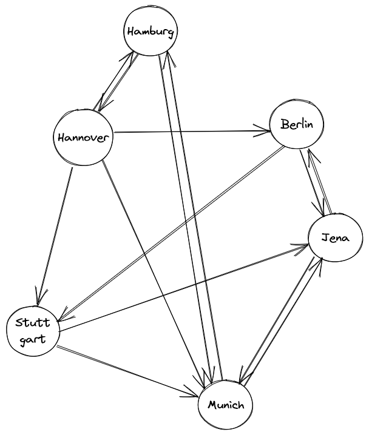
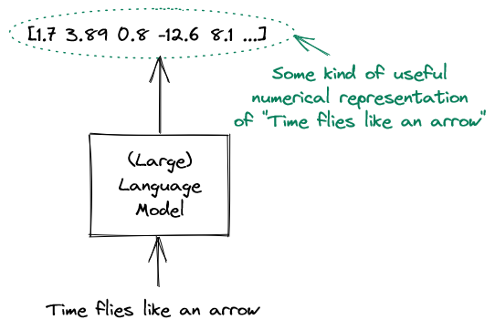
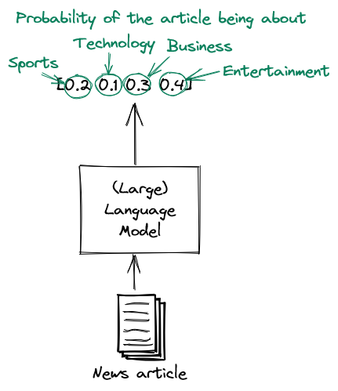
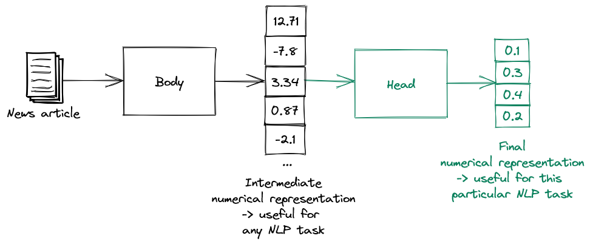

# High-level overview

This chapter contains a very high-level overview of the topics discussed in this book. It serves both as an introduction for this book as well as a standalone text for those who don't care about technical details, but want to get a general feel for the field.

## Machine learning

Consider the problem of sorting a list of numbers. For example given the list [1, 3, 4, 2, 5] you might want to output the list [1, 2, 3, 4, 5]. It is relatively easy to come up with a series of steps that solves this problem. For example we could repeatedly swap numbers in multiple passes through the list until the list is sorted (this is what BubbleSort does). Sorting a list is therefore a *classical problem* - you can formally define a series of steps (an *algorithm*) that solves the problem.

On the other hand consider the problem of recognizing the category of a document. For example, given an email we might want to tell whether it is spam or not spam. While (*most*) humans are capable of solving such problems with little effort, it is not at all clear how one would specify a formal series of steps in this case. Imagine trying to explain to someone *why* you recognized that particular email as a spam. Any description you could come up with would be very fuzzy and informal. You can't just say that e.g. the presence of "viagra" indicates spam (although such a classifier would probably be not *all* that terrible). This means that - contrary to the sorting problem - we can't easily translate such a description into an algorithm. We need a different angle of attack.

Let us rethink this whole process. When we recognize a spam email, we don't actually go through a giant checklist that someone specified for us and think "well, yeah there was word X in position Y, therefore since word A is also present in position B the email is spam". Instead we have *learned* how spam looks like, because we have observed a lot of spam. This is how we came up with that fuzzy mental image of spam that is so hard to formalize. Basically we think "well this email is very similar to a bunch of spam emails I saw previously and also I learned that these combinations of words might indicate spam, so it is probably spam".

Can we replicate something like this when trying to solve such a problem using a computer? It turns out, we can! This is where the area of **machine learning** comes in.

The basic idea behind machine learning is to solve tasks for which there is no clear solution description by feeding a bunch of *data* into a mathematical model and letting the model *learn* the solution. This process is called *training* the model (or *fitting* the data). It's like showing a bunch of cats to a baby and hoping that the baby learns to recognize a cat.

In order to perform machine learning, we therefore need the following components:

1. A mathematical *model* that specifies how to transform a given input into the desired output
2. The *data* we use for training the mathematical *model*
3. A *learning algorithm* that tells us how to train the model given the data we have

Very roughly, the learning algorithm looks like this:
```
initialize a model

for every data point in our data:
    update the parameters of the model such that
    the model performs better on that example
```

This is only a very rough outline. In reality we often feed multiple examples at the same time (to improve the training speed). We also often do multiple passes on the dataset. Nevertheless, the above process is a useful mental model to have when you think about the way machine learning models are trained.

After training is complete, we can then perform *inference*. This just means that we feed the model examples that is hasn't potentially seen before and ask it to output predictions for the examples. Of course this means that we can't just blindly memorize the training data - our model has to actually learn something.

From the above description you can probably already see a potential problem you should be aware of when throwing machine learning at your problems. Your model is only going to be *as good as the data you give it*. Consider training a document classification model on a bunch of books from the seventeenth century. It will probably perform poorly if you then give it a bunch of tweets. Machine learning can't do magic - it will learn based on the data you give it - no less, no more.

Another thing about machine learning is that you should use it when appropriate. Applying it to problems where there already is a formal solution is not a good idea. If you can solve a problem without machine learning, you should!

## Types of machine learning

There are a lot of fancy words being thrown around whenever people talk about machine learning. However most of them actually represent very simple concepts. Note that we focus on the types of machine learning we actually discuss in this book.

A **supervised learning** task is a task where we need to predict labels given inputs. Therefore the training data has been *labeled* (or *annotated*) by a human. For example if we want to differentiate spam from no spam, we would create a dataset containing a bunch of emails labeled "spam" and a bunch of images labeled "no spam". Then we could train a model on this data set. At inference time such a model could then predict whether an email is "spam" or "no spam".

**Classification** is a subfield of supervised learning where the labels represent categories. Given a data point, we then want to predict the category of that data point. Our spam recognition problem is an example of **binary classification**, since two classes are present ("spam" or "no spam"). If more than two classes are present, we are dealing with **multiclass classification**. Consider the problem of predicting the class of a news article as either "business", "sport", "entertainment" or "politics". Here we have a multiclass classification problem with four possible classes.

In **unsupervised learning** the data is not *labeled* and we want to learn or find useful relationships in the data. For example, given a bunch of documents, we could cluster them according to their similarity. Such clusterization could e.g. reveal different document categories.

## Deep learning

**Deep learning** sounds very - well - *deep*. However it is nothing more that a subfield of machine learning, where the mathematical model is a so-called **neural network**.

A **neural network** is a *differentiable computational graph*. If you a limited technical background, this sounds very scary. But the basic idea is actually fairly simple. Let us walk through the terms one by one.

A **graph** consists of nodes and edges. The edges connect the nodes. A classical example is a transportation network. Here the nodes might represent cities and the edges roads between the cities. This is how we could visualize such a graph:



A **computational graph** is a graph where each node represents a mathematical *calculation* and each edge represents a value. Here is an example of a very simple computational graph:


The neat thing about computational graphs is that they can represent extremely complicated mathematical functions. After all, no matter how complex the function is, we can (almost) always decompose it into a bunch of simple computations and construct the computational graph from that.

The final touch is that neural networks are not just any computational graphs, but *differentiable* computational graphs. This means that if we discover that our neural network makes errors on certain data points, we can calculate the *contribution of every value to the error*. Therefore we are able to update the values of the network in such a way that the error is reduced.

This is what makes neural networks extremely powerful! We can show them a bunch of data, figure out the errors the network makes on that data and then update the network values in such a way that those errors are as small as possible.

Chapter 2 explains how all this functions in great technical detail.

## Evaluating a model

Unless the task at hand is relatively simple, our model is certainly not going to be perfect. Therefore we need to quantify how good it is using an **evaluation metric**. If we have such an evaluation metric we can compare models against each other and pick the best one.

A very simple (yet very common) evaluation metric used with classification tasks is **accuracy**. We obtain the accuracy of a model on a dataset by simply dividing the number of correct classifications on the dataset by the total number of points in the dataset.

The astute reader may notice a problem here - *which dataset should we use for evaluation*? If we use the same dataset we trained on, we run into the problem that such an evaluation is meaningless. Consider a machine learning model that simply remembers all the classes it saw at training time. Such a model would have a perfect accuracy of 1.0 under our definition of accuracy! But of course, as soon it sees data is hasn't seen before (which is the *whole point* of doing machine learning), this model will crash and burn. This is an extreme example of **overfitting**. In general overfitting occurs when we accidentally fit a model too close to the idiosyncrasies of a training dataset instead of learning the more general patterns which are present.

In order to avoid this problem, we split the dataset into a **training dataset** and a **test dataset**. We use the training dataset for - well - training and the testing dataset for performing evalution. That way we model the real world, where the model has to perform well on examples it has never seen before. Of course, it is extremely important to *never* let the model see the test dataset during training.

Sometimes we need to split the dataset even more. Let's say we want to train multiple machine learning models and use the best one. If we do the selection using the test dataset, we have the same problem as above - our final evaluation will be too biased towards a particular dataset (the test dataset this time). In such a situation we need to split the dataset into a **training dataset**, a **validation dataset** and a **test dataset**. We train the models on the training dataset. Then we select the model which performs best on the validation dataset. Finally we report the accuracy of that model on the test dataset.

## Natural Language Processing

Deep Learning has been applied to many fields, but in this book we will focus exclusively on the field of **Natural Language Processing** (NLP for short). After all the title of this book is "Large *Language* Models" (and not, say "Large *Vision* Models"). As the name already says, NLP concerns itself with stuying natural language using methods from mathematics and computer science.

There are many NLP tasks to which deep learning has been applied successfully in the past decades.

We have already discussed the task of **document classification**, where we want to find the category a document belongs to.

For the task of **text summarization** we are given a text and are tasked with giving a useful summary of that text. As you can easily see, coming up with a precise algorithm for this task is even more impossible than for document classification.

A task millions of people have to solve every day is the task of **machine translation**, where you need to translate a text from one language to another. While the field used to be dominated by linguistic and statistical methods, in the past few years it has been completely overrun by Deep Learning. This happened for a simple reason - on average, Deep Learning methods perform *much* better than their counterparts.

Another task is the task of **question answering**. Given a text and a question about that text, a model is supposed to output the correct answer.

These are only a few examples of problems NLP tries to address. Others include **named entity recognition** (recognizing named entities such as organizations, locations etc), **part-of-speech tagging** (marking words with their corresponding part of speech, like "noun" or "verb"), **semantic similarity** (measuring how close the meaning of two texts is) and many more.

## Language models

We will use a very general definition of the term "language model" in this book, namely as a model that takes a text and produces a *useful (numerical) representation* of that text. As a side note, a lot of other literature uses the term "language model" exclusively for models which are capable of predicting the probabilities of text given some other text. Both definitions are totally fine, just keep in mind that we will stick to the first one.

This is how it would look like in an image: 



What could a useful numerical representation be? Well that depends on the task at hand. For a document classification problem this could be a list of probabilities of the various classes: 


If we have a multiclass problem, the list of probabilities would be longer. Here is how a language model for classifying a news article could look like: 



We would train a language model by taking a dataset and learning the task. However it turns out that such datasets need to be very large. This is mainly because natural language is complicated (ever tried to learn a foreign language?) and therefore we need huge amounts of data to learn its basic principles before we can actually solve the given task.

But what if instead of learning the English language from scratch every time we want to do some simple document classification we could create a big model that already *understands* English language and then just *fine-tune* it for the respective tasks?

## Transfer learning

The core idea behind **transfer learning** is to pretrain the model on a very large general language corpus to give it language understanding and then fine-tune it for the specific task. We essentially do this by splitting the model into a body and a head. The body takes a bunch of text and produces an *intermediate numerical representation* that is useful for any language task. Such a representation should have a bunch of desirable properties, such as similar texts being mapped to similar representations. This intermediate representation then gets fed into the model head.


