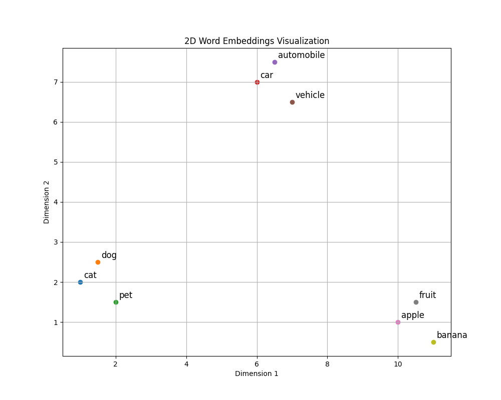
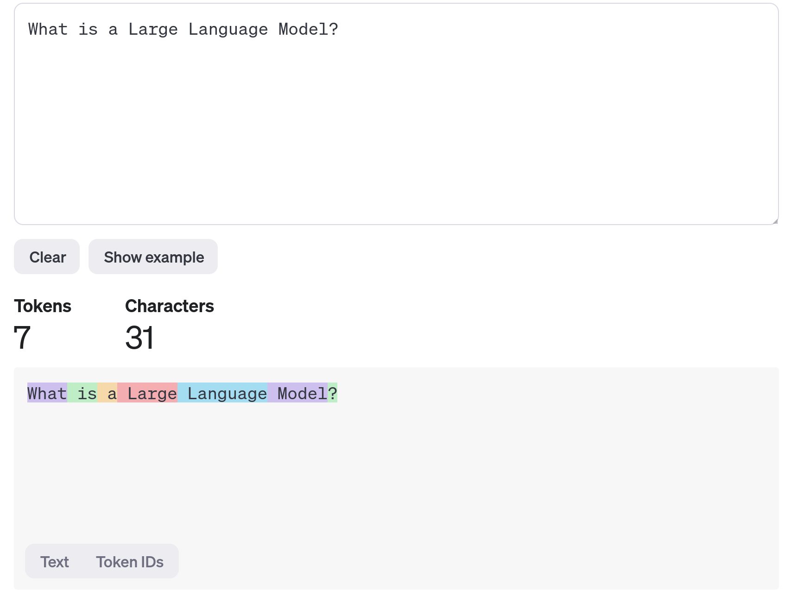
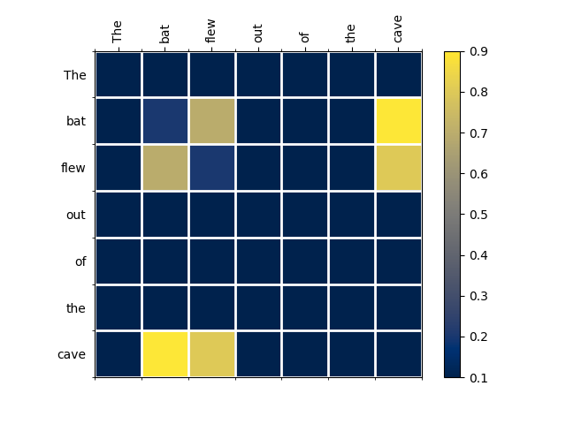

# High-Level Overview

This chapter contains a very high-level overview of the topics discussed in this book. It serves both as an introduction for this book as well as a standalone text for those who don't care about technical details, but want to get a general feel for the field.

## Executive Summary

First of all, Large Language Models are **next token predictors**.

What do we mean by that?
At its core, you give an LLM a text and it predicts the next token.
A token is basically just a part of a text (for example a token might be “an” or “123” or “this” or “th”).

For example, the input text could be the text “What is a Large Language”.
Then the LLM might predict that the next token should be “ Model”.
The resulting text would then be “What is a Large Language Model”.

However, if ever you talked to something like ChatGPT, you know that LLMs don’t just give the next token, but instead respond with complete texts.
How do they do that?

The answer is embarrassingly simple - _LLMs generate texts one token at a time_.

Again, let’s say that the text to be completed is “What is a Large Language”.

The LLM might predict “ Model” as the next token.
Now you would take the text together with the next token (“What is a Large Language Model”) and feed it into the model again, asking it to predict the next token which might be “?”.
You can now again take the text together with the next token (“What is a Large Language Model?”) and feed it into the model.

This process continues until either a maximum number of tokens has been reached or the predicted token is a special EOS (end of sequence) token which basically stands for “this sequence is over, stop generating”.
For example, if upon feeding the text “What is Large Language Model?” the model predicts the EOS token as the next token, the generation would end.

Ok, so LLMs complete texts by repeatedly predicting the next token.
But how do they predict the next token?
To adequately explain that, we need to introduce a concept called “embeddings” first.

## It’s Numbers All The Way Down

LLMs consist of mathematical functions (more on this later).
Mathematical functions tend to work with numbers instead of texts, so to apply functions to texts, we usually need to convert the texts to numbers first.

However, we don’t want to convert texts to arbitrary numbers.
Instead, these numbers should have some meaning.

This is the core insight behind embeddings - an embedding is a point in some high-dimensional space that represents some piece of a text in a meaningful way.

How can we make this more concrete?
Let’s say you would like to represent the words “cat”, “dog”, “pet”, “car”, “automobile”, “vehicle”, “apple”, “banana” and “fruit” using points in two-dimensional space.

It seems that in order for our representation to be meaningful the words “cat”, “dog” and “pet” should be close to each other.
The same should probably be true for “car”, “automobile” and “vehicle”.
Finally, “apple”, “fruit” and “banana” should be close to each other as well.
However, “cat” and “car” should be far apart, because they are semantically different (even though there is only a one-letter difference between them).

Here is how this could look like:

Mathematically, a point is just a list of numbers (for example, the word “cat” is represented by the point (1, 2) in this example), i.e. a vector.

Therefore, embeddings of texts are vectors with the property that two embeddings are close to each other if the underlying texts are semantically similar.

We can apply this concepts to more than just words.
Embeddings can be created for sentences, paragraphs, articles and any arbitrary pieces of text (i.e. any tokens).

The concept of semantic similarity is usually formalized using the distributional hypothesis:

**Words (more generally, tokens) are similar if they appear in similar contexts.**

This is why we would say that “cat” and “dog” are semantically similar (even though obviously cats and dogs are very different pets) - because they appear in similar contexts (namely, when we talk about pets).

One final important thing to note is that, in practice, embeddings have much more dimensions than just two - for example, embeddings that are utilized in modern LLMs have anywhere from hundreds to thousands of dimensions.

## The Four Components of a Large Language Model

Armed with this newfound knowledge, we can sketch out the four fundamental components of most Large Language Models.

The first component is the tokenizer.
The tokenizer is responsible for splitting the texts into tokens.

For example, the tokenizer used by GPT-4 would take the text “What is a Large Language Model?” and split it into the following tokens:

- “What”
- “ is”
- “ a”
- “ Large”
- “ Language”
- “ Model”
- “?”

Here is how you could visualize this:

Note that the GPT-4 tokenizer would not always split the text into word tokens.
For example, if you would take the english word “overfitting”, the resulting tokens would be “over”, “fit” and “ting”.

> Technical Completeness Note: In reality, the tokenizer produces token IDs which are special numbers that represent the tokens. However, this is not particularly relevant for high-level understanding.

The second component is an **embedding layer**.
The embedding layer takes the list of tokens produced by the tokenizer and produces an embedding for each token.
Consider the list of tokens from our example:

- “What”
- “ is”
- “ a”
- “ Large”
- “ Language”
- “ Model”
- “?” 

Here we have seven tokens.
This means that the embedding layer would produce seven embeddings (one embedding per token).

The first embedding would be a vector representing the token “What”, the second embedding a vector representing the token “ is” and so on until we arrive at the last embedding representing the token “?”.

Remember that embeddings are lists of numbers (vectors) that represent points in high-dimensional space in a semantically meaningful way.
Therefore the output of the embedding layer would be seven lists of numbers which have some semantic meaning.

> Technical Completeness Note: In addition to token embeddings, there are also positional embeddings and more.
> We will gloss over them, since these are mostly technical optimizations and - again - not particularly relevant for the high-level understanding.

The third component is the **transformer**.
The transformer is really the core component of modern LLMs.
It basically takes the embeddings and mixes them together to provide context.

Why is this important?
Consider the two sentences “The bat flew out of the cave” and “He hit the ball with his bat”.
In both texts, the token “bat” is present, however it has a completely different meaning in each sentence.
Therefore, the embedding layer would produce the same embeddings for the “bat” token in both cases.

The transformer now introduces context using something called the attention mechanism.
This allows the other tokens to - well - pay attention to other relevant tokens.
For example, “bat” might “pay attention” to “flew” and “cave” in the first sentence and “pay attention” to “hit” and “ball” in the second sentence.

Let’s consider the sentence “The bat flew out of the cave”.
Then attention scores for this sentence might look like this:

Here we have a high attention score between “flew” and “bat”, as well as a high attention score between “bat” and “cave”. This means that the transformer knows that the most relevant tokens for “bat” are “flew” and “cave”, i.e. this is the type of bat that flies out of caves.

Now let’s consider the sentence “He hit the ball with his bat”:

Here we have a high attention score between “bat” and “hit”, as well as a high attention score between “bat” and “ball”.
In this case, the transformer knows that the most relevant tokens for “bat” are “hit” and “ball”, i.e. this is completely different type of bat - the type that can be used to hit balls.

The transformer would now mix the “bat” embedding with the “flew” and “cave” embeddings in the first sentence.
In the second sentence however, the transformer would mix the “bat” embedding with the “hit” and “ball” embeddings.

The embeddings for “bat” would therefore be completely different in each sentence, because they now have context - we call these contextualized embeddings.

> Technical Completeness Note: The attention mechanism is relatively complicated and traditionally involves converting the embeddings to key and query vectors, computing attention scores and then using the attention scores to combine value vectors.
> Since this a high-level overview, we will not dive into the computations here.

The fourth component is a prediction layer.
This takes the embeddings created by the transformer and produces a huge list of probabilities for the next token.
For example, if the input text was “What is a Large Language” then the token “ Model” would have a high probability, but the tokens “homework” or “fngrl” would probably have a low probability.

The interesting thing here is that you can use this list of probabilities in different ways.
You could of course just always select the most probable token.
However, this often leads to boring and repetitive texts.
Instead, LLMs usually sample from this distribution.
This means that they randomly select a token in such a way that tokens with higher probabilities have a higher chance to be generated.

To sum it up - here is how an LLM predicts the next token given a text:

First, the tokenizer splits the text into tokens.
Second, the embedding layer generates an embedding for every token.
Third, the transformer improves the the embeddings by mixing them together.
Finally, the prediction layer generates a list of probabilities for all possible next tokens and samples the next token.

## Training a Large Language Model

Ok, so far, so good.
But why do companies like OpenAI and Antrophic have to spend tens of millions of dollars on their Large Language Models?

Well, remember all those mathematical functions from the previous paragraphs?
These functions usually have billions upon billions of parameters.

And these parameters have to be learned - we call that "training the model".

To train the model, we need to collect a giant dataset first.
And by giant I mean giant.
For example, the RedPajama-Data-v2 dataset (one of the most well-known open datasets) has 20 billion documents consisting of 30 trillion tokens.
This is a lot of tokens.

The way the actual training works is conceptually simple:
First, we initialize the model with random parameters.
Next, we split our text corpus into tokens.
Then we iterate over all the tokens and at each token, we ask the model to give the probabilities for the next token (this is the output of the prediction layer, remember?).
Finally, we adjust the parameters of the model in such a way that the actual next token becomes more probable and all other tokens become less probable.

This is really it, although quite often after the initial training is done, models are usually finetuned (i.e. trained further) on special datasets that make the model less likely to produce undesired outputs, allow the model to chat with a user etc.

> Technical Completeness Note: We necessarily glossed over a lot of technical details in this section.
> For example, we don't really train models token by token. Instead, the model is fed batches of training data and processes multiple examples at the same time.

While conceptually simple, the mathematical details and technical execution can get quite complicated.
For example, just recently Meta announced two 24k GPU clusters to manage model training.
As you can guess, managing these clusters and running the training requires a high degree of technical sophistication and a lot of resources - not many companies can do something like this.